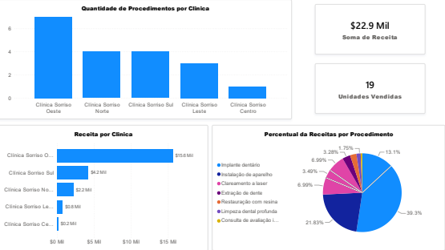

# 🦷 Dashboard de Vendas de Clínicas Odontológicas

Este repositório apresenta um **dashboard interativo de análise de vendas** para uma rede fictícia de clínicas odontológicas. O projeto utiliza **dados simulados de transações dentárias** — incluindo consultas, implantes e clareamentos — para gerar insights claros sobre o desempenho das clínicas.

---

## 📊 Funcionalidades

- **Análise de Receita:** Visualize a receita total por clínica e por tipo de procedimento.  
- **Quantidade de Procedimentos:** Gráficos de barras para entender a distribuição de procedimentos por clínica.  
- **Percentuais:** Gráficos de pizza mostrando a proporção da receita por tipo de procedimento.  
- **Dados Fictícios Reproduzíveis:** Baseados em CSVs gerados aleatoriamente com sementes definidas para consistência.  
- **Validação de Dados:** Scripts que unem tabelas de vendas e preços para conferir cálculos e consistência dos dados.

---

## 🖼 Visualização do Dashboard

---

## 🛠 Tecnologias Utilizadas

- **Python 3** – para manipulação e análise de dados.  
- **Pandas** – processamento e validação dos dados.  
- **CSVs** – `vendas_clinicas_odontologicas.csv` e `tabela_precos.csv` para armazenamento dos dados.  
- **Dashboard em PDF** – `dashboard_vendas.pdf`; facilmente expansível para **Tableau**, **Power BI** ou **Streamlit**.

---

## 🚀 Objetivo do Projeto

Este projeto é ideal para **estudos de análise de dados, Business Intelligence (BI)** ou **prototipagem de dashboards**, permitindo explorar técnicas de visualização e interpretação de métricas de vendas em clínicas odontológicas.

---

## 📌 Observações

- Todos os dados são **simulados** para fins educativos e de prática em análise de dados.  
- A lógica de cálculo e validação está disponível no script `dados_vendas.py`.  
- O dashboard pode ser facilmente adaptado para outras plataformas de BI ou dashboards interativos.

---

💡 **Experimente expandir este projeto** usando **Streamlit**, **Power BI** ou **Tableau**, conectando os CSVs para criar dashboards dinâmicos e interativos!

